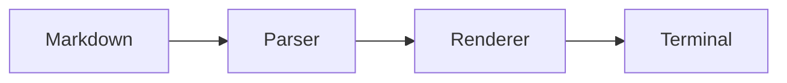
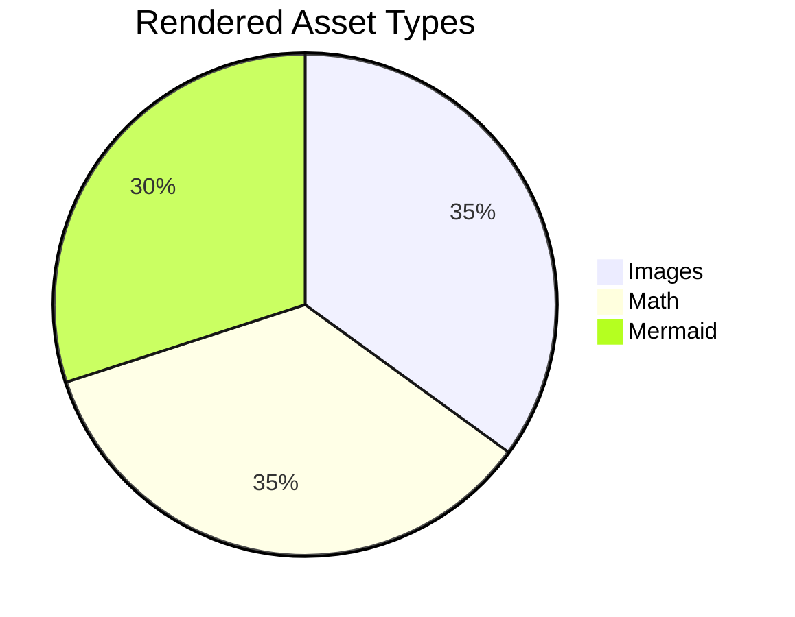
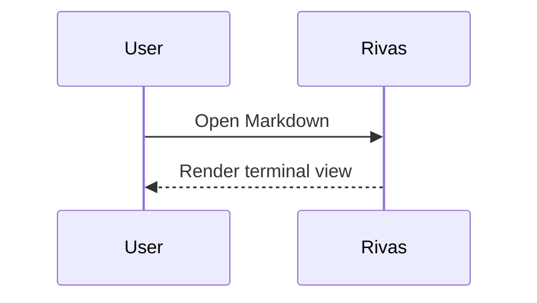

# Rivas Rendering Cases 🌱

This file is a rendering fixture for the Markdown objects Rivas supports.

## Paragraphs And Inline Text

Plain text should wrap naturally across terminal columns. This paragraph includes
soft line breaks in the source that should remain part of the same paragraph
unless Markdown requires a hard break.

This paragraph contains **strong text**, *emphasis*, ~~strikethrough~~,
`inline code`, a [link to the Rust website](https://www.rust-lang.org/), and
inline math $E = mc^2$.


This paragraph has some multibyte unicode chars ⼽◉𓁛


Hard break after this line.  
This line should appear below it.

## Headings

# Heading 1

## Heading 2

### Heading 3

#### Heading 4

##### Heading 5

###### Heading 6

## Block Quote

> Rivas should render quoted text with quote styling.
>
> Quotes can contain **inline formatting** and `inline code` $x^2$.

# Remote Gif

## Lists

- Unordered item $\int_0^\infty$
- Unordered item with nested content
  - Nested item
  - Nested item with $x^2 + y^2 = z^2$
- Final unordered item

1. Ordered item $E = mc^2$
2. Ordered item with nested content
   1. Nested ordered item
   2. Another nested ordered item
3. Final ordered item

- [x] Completed task
- [ ] Open task
- [x] Task with **formatting**

## Code Blocks

```rust
fn main() {
    println!("Hello from Rivas");
}
```

```python
def fibonacci(n: int) -> list[int]:
    values = [0, 1]
    while len(values) < n:
        values.append(values[-1] + values[-2])
    return values[:n]

# Some comments
def some_func(d: int, e: int):
    """ This function does sth """
    a = {'b': 'c'}
    # Why b and not d
    f = d * e
    print(a['b'])
```

## Tables

| Item | Status | Count |
| :--- | :----: | ----: |
| Text | Ready | 12 |
| Image | Ready | 1 |
| Math | Ready | 3 |
| Mermaid | Ready | 2 |

| Month | Savings |
| --- | ---: |
| January | $250 |
| February | $80 |
| March | $420 |

## Thematic Break

Before the rule.

---

After the rule.

## Local Image


## Remote Image


## SVG Image


## Mermaid





## Inline HTML

Rivas renders the common inline HTML tags used in Mermaid labels and docs.

<b>Bold via HTML</b>, <i>italic via HTML</i>, <u>underlined</u>,
<s>strikethrough</s>, <strong>strong</strong>, <em>emphasis</em>, and
<del>deleted</del>.

<code>inline code</code> and <kbd>Ctrl</kbd>+<kbd>C</kbd>. Chemists love
H<sub>2</sub>O; physicists write E=mc<sup>2</sup>.

Line one<br>line two after a <br/> tag.

An inline image via the HTML tag: 

Unknown tags are hidden but their text is kept: <span>this content survives</span>.
HTML comments are dropped: <!--this does not show-->.

## HTML Blocks

HTML blocks render their inner text with formatting applied:

<div>
  A <b>bold</b> and <i>italic</i> word inside a <code>div</code>, with a
  <br>
  line break.
</div>

A standalone HTML image tag renders as an image block:


HTML `<pre>`/`<code>` blocks render as real code blocks (with the language from
`class="language-*"` where present):

<pre><code class="language-rust">
fn main() {
    println!("Hello from an HTML code block");
}
</code></pre>

<pre>
No language declared, but the raw lines and indentation are preserved.
</pre>

## Footnotes

Rivas supports footnotes: numeric references render as superscript markers and
definitions render with their label. Here is a numeric one[^1], a named
one[^note], and an unnamed-label edge case [^missing].

[^1]: The body of a numeric footnote can contain **inline formatting**,
`inline code`, and math $a^2 + b^2$.

[^note]: Named labels work too, and definitions support multiple paragraphs.

    This second paragraph belongs to the same footnote.

## Math

Inline math should render in text flow: $x = \frac{-b \pm \sqrt{b^2 - 4ac}}{2a}$.

A vector norm: $\|x\|_2 = \sqrt{x_1^2 + x_2^2}$.

$$
\int_0^\infty e^{-x} \, dx = 1
$$

$$
I =
\begin{bmatrix}
1 & 0 & 0 \\
0 & 34 & 0 \\
0 & 0 & x^2
\end{bmatrix}
$$

```math
\Delta(Rivas) = \delta(rivas) \times \frac{Rivas * 2}{2}
```

## Large Block (scroll test)

```json
{
  "name": "rivas-test-large-block",
  "version": "1.0.0",
  "description": "A very large JSON block to test scrolling within blocks that exceed the viewport height",
  "dependencies": {
    "react": "^18.2.0",
    "react-dom": "^18.2.0",
    "typescript": "^5.3.0",
    "vite": "^5.0.0",
    "tailwindcss": "^3.4.0",
    "postcss": "^8.4.0",
    "autoprefixer": "^10.4.0",
    "eslint": "^8.56.0",
    "prettier": "^3.2.0",
    "jest": "^29.7.0",
    "@testing-library/react": "^14.1.0",
    "@types/node": "^20.11.0",
    "@types/react": "^18.2.0",
    "lodash": "^4.17.0",
    "axios": "^1.6.0",
    "zod": "^3.22.0"
  },
  "devDependencies": {
    "@typescript-eslint/eslint-plugin": "^6.19.0",
    "@typescript-eslint/parser": "^6.19.0",
    "eslint-plugin-react": "^7.33.0",
    "eslint-plugin-react-hooks": "^4.6.0",
    "husky": "^9.0.0",
    "lint-staged": "^15.2.0"
  },
  "scripts": {
    "dev": "vite",
    "build": "tsc && vite build",
    "preview": "vite preview",
    "lint": "eslint src --ext .ts,.tsx",
    "format": "prettier --write 'src/**/*.{ts,tsx,css}'",
    "test": "jest",
    "test:watch": "jest --watch",
    "test:coverage": "jest --coverage",
    "typecheck": "tsc --noEmit",
    "clean": "rm -rf dist node_modules",
    "prepare": "husky install"
  },
  "main": "dist/index.js",
  "module": "dist/index.mjs",
  "types": "dist/index.d.ts",
  "exports": {
    ".": {
      "import": "./dist/index.mjs",
      "require": "./dist/index.js",
      "types": "./dist/index.d.ts"
    },
    "./styles": "./dist/styles.css"
  },
  "files": [
    "dist",
    "README.md",
    "LICENSE"
  ],
  "keywords": [
    "markdown",
    "terminal",
    "renderer",
    "tui",
    "rust"
  ],
  "author": "Rivas Contributors",
  "license": "MIT",
  "repository": {
    "type": "git",
    "url": "https://github.com/example/rivas.git"
  },
  "bugs": {
    "url": "https://github.com/example/rivas/issues"
  },
  "homepage": "https://github.com/example/rivas#readme",
  "engines": {
    "node": ">=18.0.0",
    "npm": ">=9.0.0"
  },
  "config": {
    "port": 3000,
    "host": "localhost",
    "logLevel": "info",
    "features": {
      "darkMode": true,
      "syntaxHighlighting": true,
      "mathRendering": true,
      "imageSupport": true,
      "mermaidDiagrams": true,
      "tableAlignment": true,
      "virtualScrolling": true,
      "vimKeybindings": true,
      "clipboardSupport": true,
      "fileWatcher": true,
      "hotReload": true,
      "debugMode": false,
      "analytics": false
    },
    "theme": {
      "name": "tokyo-night",
      "colors": {
        "background": "#1a1b26",
        "foreground": "#c0caf5",
        "accent": "#7aa2f7",
        "error": "#f7768e",
        "warning": "#e0af68",
        "success": "#9ece6a",
        "info": "#7dcfff",
        "muted": "#565f89"
      },
      "fonts": {
        "mono": "JetBrains Mono",
        "fallback": "DejaVu Sans Mono"
      }
    }
  },
  "metadata": {
    "buildDate": "2024-01-15T10:30:00Z",
    "commitHash": "abc123def456",
    "branch": "main",
    "ci": {
      "provider": "github-actions",
      "coverageThreshold": 80,
      "lintStrict": true,
      "requireTests": true,
      "buildMatrix": ["linux-x64", "macos-arm64", "windows-x64"]
    }
  }
}
```

This is a regular paragraph after the large block. It should be visible when you scroll past the JSON block.

## Mixed Content

1. Render text first.
2. Render inline math $a^2 + b^2 = c^2$.
3. Render a diagram:



4. Render a final image:


